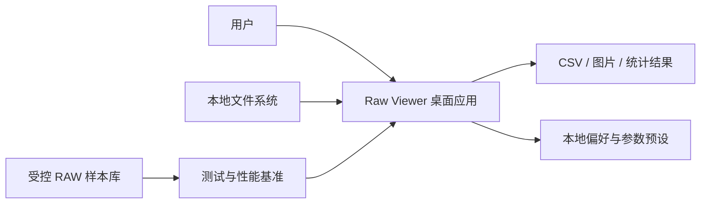
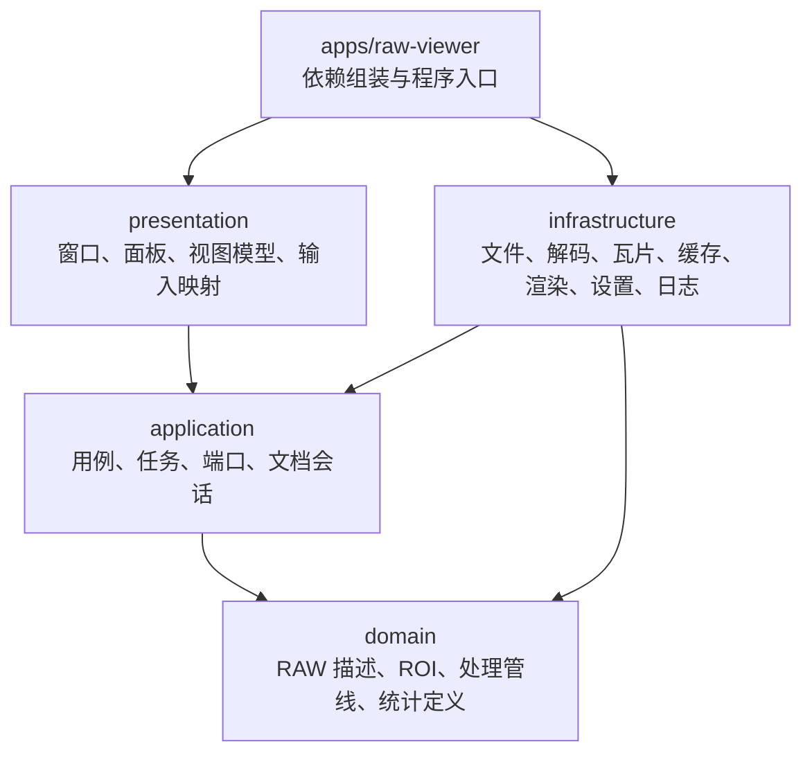
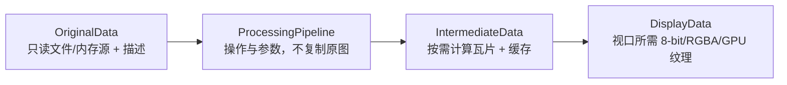

# Raw Viewer V0.1 架构设计

- 状态：提议，作为三阶段实现的设计基线
- 日期：2026-07-30
- 输入：`require/Raw_Viewer.md`
- 目标：桌面 Bayer RAW 浏览、处理和统计软件

## 1. 结论

推荐采用 **C++20 + Qt 6 Widgets + CMake**，以领域层、应用层、基础设施层、表现层和组装入口构成分层架构。

该选择适合当前需求的原因：

- 桌面三栏布局、菜单、状态栏、工具窗口、文件树和主题可直接使用 Qt Widgets；
- `QImageReader` 能统一读取 JPG、PNG、BMP 等常见格式；
- Qt 提供文件系统模型、设置存储、撤销框架、并发和 OpenGL 窗口集成；
- C++ 可对 RAW 端序转换、瓦片解码、统计归约和内存布局进行精确控制；
- CMake Presets 能让本地与 CI 使用一致的构建入口。

架构的核心不是“把 400 MB 文件完整读入后复制处理”，而是：

> 不可变原始源 + 非破坏性处理管线 + 按需瓦片计算 + 有界缓存 + 分辨率金字塔 + 可取消后台任务。

## 2. 范围

### 2.1 本设计覆盖

- 主窗口布局、菜单、状态栏、文件列表和主题；
- 普通图片和无头/带头 Bayer RAW 文件读取；
- 原始、中间、显示三层数据；
- 缩放、平移、像素标注和双图对比的交互模型；
- BLV/WLV/Gamma、Pixel Info、Pixel Statistics、Bayer Extract；
- 五步撤销；
- 2 亿像素、约 400 MB 文件的性能策略；
- 后续 ISP 工具扩展；
- 测试、日志、发布和长期维护边界。

### 2.2 本设计暂不承诺

- 相机厂商封装 RAW（CR2/CR3/NEF/ARW 等）的完整解码；
- packed 10/12/14-bit RAW；
- 多帧 RAW、文件头自动识别或相机元数据数据库；
- 完整 ISP 质量指标和色彩管理；
- 跨平台首发；
- 第三方二进制插件 ABI。

这些能力可以扩展，但不能在未定义数据格式和验收样本时默认包含。

## 3. 关键质量目标

| 属性 | 目标 | 架构措施 |
|---|---|---|
| 正确性 | 原始数据永不被处理操作修改 | 不可变 `ImageSource`，参数化处理管线 |
| 大图能力 | 200 MP / 400 MB 文件可打开、浏览、取消操作 | 内存映射、瓦片、金字塔、有界缓存、后台任务 |
| 响应性 | UI 线程不执行大文件读取和全图统计 | 应用任务调度器、进度与取消 |
| 可扩展 | 新统计/ISP 工具不侵入主窗口和 RAW 解码器 | Tool/Operation 接口、注册表、端口适配器 |
| 可测试 | 解码、处理、统计可脱离 UI 测试 | 领域与应用层无 QWidget 依赖 |
| 可维护 | 决策、风险、样本和需求均可追踪 | ADR、追踪矩阵、风险与样本登记 |
| 可恢复 | 错误不会破坏输入，过期任务不污染界面 | 只读输入、原子状态切换、任务世代号 |

首轮性能数字仍需真实设备和样本校准，不能将“不卡顿”作为验收标准。

## 4. 系统上下文



应用默认离线运行。任何崩溃报告、更新检查或远程样本访问都必须作为后续显式功能，不得默认上传文件或日志。

## 5. 分层架构



### 5.1 领域层 `src/domain`

职责：

- `RawDescriptor`：宽、高、头字节、行步长、存储位宽、有效位深、标量类型、端序；
- `BayerPattern`：RGGB、BGGR、GRBG、GBRG、Mono/None；
- `ImageGeometry`、`PixelCoordinate`、`RegionOfInterest`；
- `ProcessingPipeline`：按顺序保存非破坏性操作描述；
- `DisplayMapping`：显示黑点、白点、Gamma；
- `StatisticsRequest`、`StatisticsResult`；
- 纯算法与不变量验证。

领域层不打开文件、不创建 QWidget、不读注册表、不调用 OpenGL。

### 5.2 应用层 `src/application`

用例：

- `OpenImage`、`CloseImage`、`ReloadFolder`；
- `UpdateRawDescriptor`、`UpdateDisplayMapping`；
- `RenderViewport`、`QueryPixel`；
- `ApplyOperation`、`UndoOperation`、`RedoOperation`；
- `ComputeStatistics`、`ExtractBayerChannel`；
- `SetComparisonMode`、`SynchronizeViewTransform`。

端口：

- `IImageDecoder`、`ITileSource`；
- `IRenderer`、`IStatisticsEngine`；
- `ISettingsStore`、`IJobScheduler`、`ILogger`；
- `IClock`（用于可测试的节流和耗时记录）。

应用层拥有 `DocumentSession`。每个打开图像有独立的处理状态、视图状态、ROI、撤销栈和任务世代号。

### 5.3 基础设施层 `src/infrastructure`

适配器：

- `QtImageDecoder`：通过 `QImageReader` 读取 JPG/PNG/BMP；
- `BinaryRawDecoder`：按 `RawDescriptor` 验证并解释 `.raw/.RAW/.bin`；
- `MappedFileSource`：只读文件映射与对齐窗口；
- `TiledImageSource`：按瓦片读取与解码；
- `PyramidCache`：按需生成缩略层；
- `CpuProcessingEngine`、`CpuStatisticsEngine`；
- `OpenGLTileRenderer` 与安全的 CPU 回退；
- `QtSettingsStore`、结构化本地日志。

### 5.4 表现层 `src/presentation`

- `MainWindow`：菜单栏、三栏中心区、状态栏；
- `RawParametersPanel`；
- `FileBrowserPanel`；
- `ImageViewport` / `ComparisonViewport`；
- `HistogramPanel`、`DisplayControlsPanel`、`ToolPanel`；
- `PixelInfoDialog`、`PixelStatisticsDialog`、`BayerExtractDialog`；
- `ThemeManager`；
- 各视图模型与命令绑定。

表现层只收集输入、展示状态和触发用例，不解析 RAW 字节或遍历亿级像素。

### 5.5 组装入口 `apps/raw-viewer`

负责：

- 创建 Qt 应用；
- 选择实际适配器；
- 注入线程池、缓存预算、日志和设置；
- 安装全局异常边界；
- 不包含业务规则。

## 6. UI 结构

```text
┌──────────────────────────────── 主菜单 ────────────────────────────────┐
│ 文件 | 编辑 | 偏好 | Tool | 帮助                                     │
├───────────────┬───────────────────────────────────┬────────────────────┤
│ RAW 参数      │                                   │ 全图统计/直方图    │
│ head          │                                   ├────────────────────┤
│ width/height  │           图像显示区域            │ BLV/WLV/Gamma      │
│ bit/type      │           约 60% 宽度              ├────────────────────┤
│ endian/BLV    │                                   │ Pixel Info         │
├───────────────┤                                   │ Pixel Statistics   │
│ 路径/刷新/上级│                                   │ Bayer Extract      │
│ 文件树        │                                   │ 预留 ISP 工具      │
├───────────────┴───────────────────────────────────┴────────────────────┤
│ 状态栏：坐标、原始值/RGB、尺寸、缩放、任务状态                         │
└────────────────────────────────────────────────────────────────────────┘
```

实现建议：

- 使用 `QMainWindow`、`QMenuBar`、`QStatusBar`；
- 中央区域使用嵌套 `QSplitter`，初始比例 20/60/20，但允许用户调整；
- 左侧上下区域和右侧各区域使用可折叠容器，不硬编码像素高度；
- 文件树使用只读 `QFileSystemModel`，避免浏览器意外提供删除能力；
- 工具窗口以非模态窗口或 dock 呈现，统计任务运行时主视图仍可操作；
- `ThemeManager` 使用语义色 token，提供 Dark、Light（需求中的 `lit` 视为拼写修正）、Gray、Yellow、Red；
- Yellow/Red 主题仍需满足文字对比度，不能把警告色同时当普通背景色。

## 7. 数据模型

### 7.1 三层数据



#### 原始数据 `OriginalData`

- 生命周期覆盖整个文档会话；
- 普通图片保留解码后的不可变源，条件允许时同时保留文件引用；
- RAW 优先保留只读文件映射/文件句柄，而不是无条件复制 400 MB；
- 包含来源路径、文件大小、修改时间和可选 SHA-256；
- 处理操作不能获得可写指针。

#### 中间数据 `IntermediateData`

- 不是固定的一张完整图片；
- 由 `ProcessingPipeline`、瓦片坐标、层级和参数哈希标识；
- 缓存键建议为：

```text
sourceId + pipelineRevision + pyramidLevel + tileX + tileY + channelMode
```

- 参数变化使相关缓存失效，不修改原始数据；
- 复杂 ISP 操作可以声明 halo（邻域边缘）和输出像素格式。

#### 显示数据 `DisplayData`

- 只覆盖当前视口和少量预取范围；
- 经过显示映射后生成 RGBA8 或 GPU 纹理；
- 像素查询始终能同时返回原始值和当前显示值；
- 不作为后续算法的输入真值。

### 7.2 RAW 描述必须拆分的字段

| 字段 | 说明 |
|---|---|
| `headerBytes` | 文件头跳过字节数 |
| `width` / `height` | 有效图像尺寸 |
| `rowStrideBytes` | 每行实际字节数；不能总是假设紧密排列 |
| `storageBits` | 每个样本在文件中占用 8/16/32 位 |
| `validBits` | 有效信号位数，初期可等于 storageBits |
| `scalarType` | unsigned integer / signed integer / float |
| `byteOrder` | little-endian / big-endian |
| `bayerPattern` | RGGB/BGGR/GRBG/GBRG/Mono |
| `sensorBlackLevel` | 传感器黑电平，仅处理管线使用 |

当前 UI 需求把 `bit` 预设为 8/16/32，但 32 位数据可能是 UInt32 或 Float32，仅靠“大小端”无法判定，必须增加 `scalarType`。

### 7.3 RAW 文件校验

打开前执行：

1. 所有字段范围校验；
2. 使用 checked 64-bit 算术计算最小行字节数；
3. 验证 `rowStrideBytes >= minimumRowBytes`；
4. 验证 `headerBytes + rowStrideBytes * height <= fileSize`；
5. 多余尾部字节允许但给出提示；
6. 截断、溢出、不支持打包方式返回结构化错误，不分配大块内存。

第一阶段只支持 byte-aligned 8/16/32-bit；packed 10/12/14-bit 使用独立解码器在后续加入。

## 8. 超大图方案

200 MP 图像若为 16-bit RAW，本体约 400 MB；若直接转成 RGBA8 又需要约 800 MB。再叠加五步撤销和处理副本会迅速超过普通机器内存，因此必须避免整图复制。

### 8.1 文件访问

- RAW 使用只读内存映射或分块读取；
- 映射窗口处理 Windows allocation granularity 对齐；
- 普通压缩图先查询尺寸和能力；若解码器不支持区域读取，则显示进度、支持取消并限制峰值内存；
- 原文件被外部修改时，以文件大小/时间戳检测并提示重新加载，不静默混用旧映射。

### 8.2 瓦片与金字塔

- 建议基础瓦片 512×512，实际值由基准测试决定；
- 视口只请求可见瓦片并预取一圈；
- 缩小显示使用 1/2、1/4、1/8… 金字塔层，避免每帧扫描原图；
- 金字塔按需生成，可在内存缓存；磁盘缓存作为后续优化并带版本/校验和；
- 缓存使用 LRU 和硬预算，建议默认不超过可用内存的 25%，同时设置绝对上限；
- 缓存淘汰不能影响原始数据和处理管线状态。

### 8.3 并发与取消

- UI 线程只提交任务和消费小型结果；
- IO/解码、处理、统计可使用不同优先级队列；
- 当前视口瓦片优先于预取，交互任务优先于全图统计；
- 每个文档维护 `generationId`；参数、文件或文档变化后，旧任务结果直接丢弃；
- 长循环按瓦片或固定行数检查取消标志；
- 关闭文档时停止提交新任务，等待资源安全释放但不长时间阻塞 UI。

### 8.4 渲染

- 第一阶段用 CPU 生成视口图像，以尽快验证正确性；
- 渲染接口从第一天隔离，第三阶段实现 `QOpenGLWidget` 瓦片纹理渲染；
- GPU 不可用或远程桌面异常时回退 CPU；
- 不在每帧读取 GPU framebuffer；
- 像素值文字只在单个源像素达到可读屏幕尺寸时显示，并设置最大标签数，避免亿级文本对象。

## 9. 处理、显示与撤销

### 9.1 区分两个“黑电平”

需求中的 BLV 存在歧义，建议拆分：

- `sensorBlackLevel`：从原始信号中扣除，属于处理操作；
- `displayBlackPoint`：只影响显示窗口，不修改中间数据。

WLV 建议命名为 `displayWhitePoint`。显示映射：

```text
normalized = clamp((value - displayBlackPoint) /
                   (displayWhitePoint - displayBlackPoint), 0, 1)
display = pow(normalized, 1 / gamma)
```

必须处理白点不大于黑点、Gamma 非正数、NaN/Inf。

### 9.2 五步撤销

- 使用命令模式，每次处理参数变更形成可撤销命令；
- 连续拖动滑块合并为一次命令；
- 每个文档独立撤销栈，初期 `undoLimit = 5`；
- 撤销命令保存前后参数和管线 revision，不保存像素缓冲；
- 平移和缩放默认为视图状态，不占处理撤销栈；如需视图历史另设导航栈。

Qt 的 Undo Framework 原生支持命令合并、宏命令和栈限制，适合作为表现/应用适配，不应让领域层直接依赖 `QUndoStack`。

## 10. 交互模型

### 10.1 单图

- 未选择工具：左键拖动平移；
- 滚轮以鼠标下的图像坐标为锚点缩放；
- 缩放变换保持双精度，渲染时才转换到屏幕坐标；
- 状态栏节流显示坐标、原始值、显示值、缩放和图像信息；
- 拖入文件只接受一个明确文件或弹出多文件处理选择，目录拖入进入文件浏览器。

### 10.2 多图对比

- 默认共享变换，主视图变换映射到其他视图相同图像坐标；
- `Alt + 左键` 只移动鼠标所在子视图；
- 不同尺寸图像按源图坐标同步，越界区域显示为空；
- 第一版对比限制为两图，避免在需求未明确前构建复杂网格。

### 10.3 工具状态

工具使用显式状态机：

```text
Navigate | PixelInfo | SelectROI | SelectLine | BayerExtract
```

同一时刻只有一个主指针工具拥有拖拽手势；工具切换必须取消未完成的选择，避免 ROI 拖拽与图像平移冲突。

## 11. 统计工具定义

### 11.1 Status

对 ROI 中的样本计算：

- count、min、max；
- 使用稳定在线算法计算 mean、variance；
- 直方图 bin 数按位深配置，16/32-bit 默认不直接创建全范围数组；
- Bayer RAW 可选择全部样本或按 R/Gr/Gb/B 分通道。

### 11.2 Horizontal area

建议定义：ROI 每一列沿 Y 方向求平均，得到长度为 ROI 宽度的一维 profile；对该 profile 计算 min/max/mean/variance 并绘制折线。

### 11.3 Vertical area

建议定义：ROI 每一行沿 X 方向求平均，得到长度为 ROI 高度的一维 profile；再计算统计量并绘制折线。

### 11.4 Line

建议定义：沿用户绘制线段按最近邻采样；后续可增加双线性插值。横轴为累计距离，纵轴为信号/RGB。

Horizontal/Vertical 的方向命名在不同软件中可能相反，因此上述定义必须由用户在编码前确认，并写入验收样例。

### 11.5 数值安全

- 计数和整数累加至少使用 64 位；32-bit 大图求和使用更宽或分块浮点归约；
- 方差使用 Welford 或等价稳定算法；
- 空 ROI、单像素方差、NaN/Inf 和越界都有明确结果；
- 统计在后台按瓦片归约，进度可见、可取消；
- 图表只保存降采样后的显示数据，完整结果按需导出。

## 12. 工具扩展模型

先使用源码级注册接口，不承诺稳定二进制插件 ABI：

```text
ITool
  id / displayName / icon
  supportedImageKinds()
  createPanel()
  createInteractionController()

IProcessingOperation
  descriptor()
  validate(parameters)
  requiredHalo()
  outputFormat()
  processTile(inputTiles, outputTile, cancellation)
```

新增 ISP 工具时：

- UI 参数面板与算法实现分离；
- 操作描述可序列化，为会话保存和复现预留；
- 操作声明邻域和边界策略；
- CPU 实现作为正确性基准，GPU 实现必须通过一致性测试；
- 破坏分层或需要新第三方依赖时新增 ADR。

## 13. 错误与日志

结构化错误至少包含：

- 稳定错误码；
- 面向用户的简短说明；
- 文件/参数上下文（脱敏）；
- 可恢复建议；
- 技术日志详情。

错误类别：

- 文件不可访问/已变化；
- 参数无效或尺寸溢出；
- 文件长度不匹配；
- 不支持的位深、标量或打包；
- 解码失败；
- 内存/缓存预算不足；
- GPU 初始化失败；
- 任务取消。

日志默认本地保存，不记录原始像素、完整客户路径或文件内容。路径可配置脱敏，只在用户主动导出诊断包时收集必要信息。

## 14. 测试策略

| 层次 | 重点 |
|---|---|
| 领域单元测试 | descriptor 校验、坐标变换、显示映射、ROI、统计黄金值 |
| 基础设施单元测试 | 端序、头偏移、stride、截断、8/16/32-bit 解码 |
| 应用测试 | 打开/取消/过期任务、撤销五步、文档切换 |
| UI 测试 | 菜单、三栏布局、拖放、主题、快捷键、状态栏 |
| 集成测试 | 小型合法样本从打开到显示/统计完整链路 |
| 性能基准 | 200 MP 打开、首次预览、平移、缩放、ROI/全图统计、峰值内存 |

测试数据分为：

- 可入库的小型合成 fixture；
- 受控存储的大型基准样本；
- 模糊测试生成的损坏/截断输入。

## 15. 构建、依赖与发布

- 使用 CMake target 表达层级，禁止全局 include path；
- 提交 `CMakePresets.json`，忽略本地 `CMakeUserPresets.json`；
- 第三方依赖锁定版本和来源，记录许可证；
- Windows 初期使用 MSVC x64；
- CI 执行配置、构建、测试、静态检查和文档检查；
- 发布包记录 commit、编译器、Qt 版本、依赖清单和 SHA-256；
- Qt 采用 LGPL/GPL 还是商业许可必须在分发前确认，不能把“免费使用”视为“没有义务”。

## 16. 待确认问题与推荐默认值

| ID | 问题 | 推荐默认值 | 不确认的风险 |
|---|---|---|---|
| D-001 | 首发平台 | Windows 10/11 x64 | 构建和 UI 细节反复 |
| D-002 | Qt 许可 | 私有开发期评估 LGPL 动态链接义务；正式分发前完成法务选择 | 发布不合规 |
| D-003 | 32-bit RAW 类型 | UI 增加 UInt32 / Float32，默认 UInt32 | 像素解释完全错误 |
| D-004 | Bayer pattern 所属 | 作为每个 RAW 文档参数，默认 RGGB 仅用于演示 | 通道/标注错误 |
| D-005 | row stride | UI 高级项，默认紧密排列 | 部分设备图像错行 |
| D-006 | BLV 语义 | 拆分 sensorBlackLevel 与 displayBlackPoint | 非破坏性原则被破坏 |
| D-007 | Horizontal/Vertical | 采用第 11 节定义 | 曲线方向与用户预期相反 |
| D-008 | 大图性能设备 | 指定一台最低配置 Windows x64 设备 | 无法客观验收 |
| D-009 | 普通压缩 200 MP 图片 | 初版尽力支持并警告；性能承诺先限定 byte-aligned RAW | 压缩解码峰值不可控 |

## 17. 官方技术依据

- Qt Undo Framework：<https://doc.qt.io/qt-6/qundo.html>
- Qt `QFile` 与内存映射：<https://doc.qt.io/qt-6/qfile.html>
- Qt Shared Memory / mapped files：<https://doc.qt.io/qt-6/shared-memory.html>
- Qt Concurrent：<https://doc.qt.io/qt-6/qtconcurrent.html>
- Qt `QImageReader`：<https://doc.qt.io/qt-6/qimagereader.html>
- Qt `QFileSystemModel`：<https://doc.qt.io/qt-6/qfilesystemmodel.html>
- Qt `QOpenGLWidget`：<https://doc.qt.io/qt-6/qopenglwidget.html>
- CMake Presets：<https://cmake.org/cmake/help/latest/manual/cmake-presets.7.html>
- Qt 许可说明：<https://doc.qt.io/qt-6/licensing.html>
